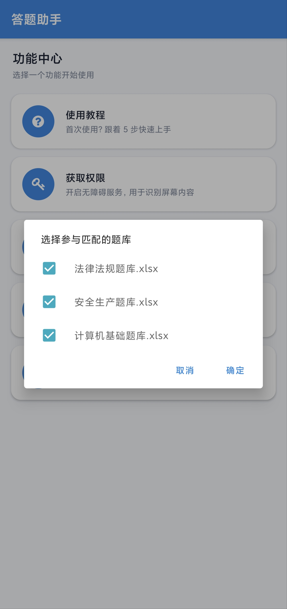
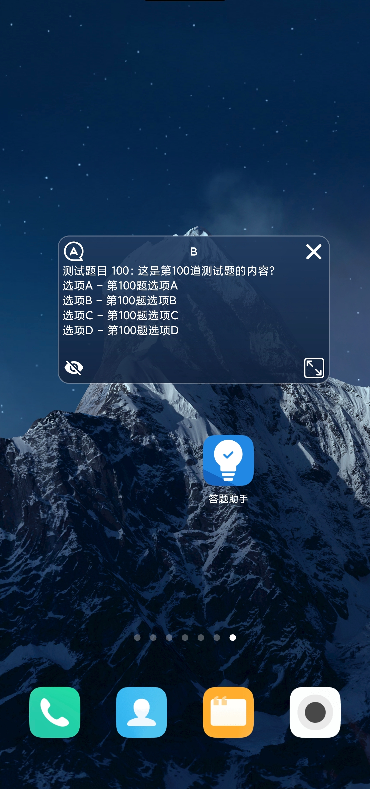
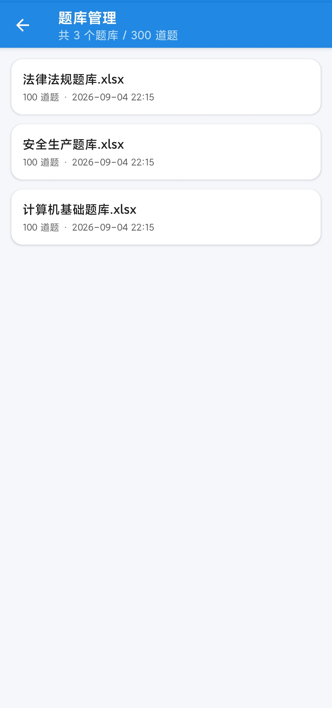
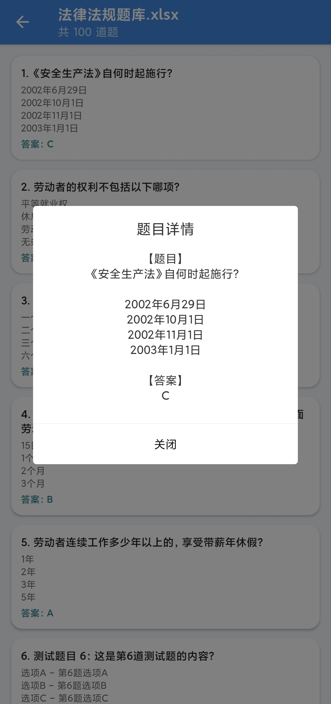
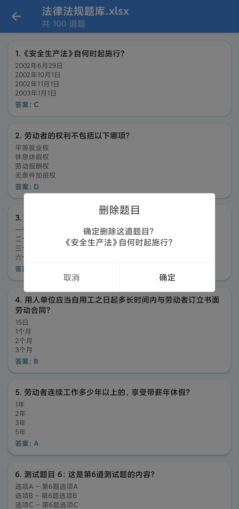

# 答题助手

> ⚠️ **声明**：本项目仅供内部学习与测试使用，请勿对外传播或用于任何违反相关规定的用途。

**答题助手**是一款基于 Android 无障碍服务的智能答题辅助工具，通过实时识别屏幕文字并智能匹配题库，在悬浮窗中即时显示匹配的题目与答案。

## 📱 快速上手

### 1. 获取权限

首次使用需开启三项权限：
- **悬浮窗**：显示答案悬浮窗
- **通知**：前台服务保活
- **无障碍服务「❤ 答题助手」**：识别屏幕文字


### 2. 导入题库

点击「**选择文件**」导入题库（支持 `.xls` / `.xlsx` / `.csv`）。

**格式要求：**
| 列 | 字段 | 必填 |
|---|---|---|
| A | 题目 | ✅ |
| B | 答案 | ✅ |
| C | 选项A | ✅ |
| D-F | 选项B-D | 选填 |

第一行为表头，从第二行开始为题目数据。

### 3. 自动扫描

点击「**自动扫描**」，勾选要匹配的题库，然后切换到答题页面即可。



悬浮窗会实时显示匹配到的题目和答案：



## 📚 题库管理

点击「**题库管理**」可查看、重命名或删除题库：



- **单击题库** → 查看题目列表
- **单击题目** → 查看详情
- **长按题库** → 重命名/删除




## 🔧 技术特点

- **无需 Root**：基于无障碍服务
- **离线匹配**：本地完成，无需网络
- **智能匹配**：IKAnalyzer 分词 + 余弦相似度
- **多库支持**：可同时从多个题库匹配

## 💡 工作原理

```
导入题库 → IKAnalyzer 分词 → 存入数据库
                                    ↓
屏幕文字 → ScreenTextFinder 抓取 → 余弦相似度匹配
                                    ↓
                            悬浮窗显示答案
```

##  常见问题

**Q: 悬浮窗不显示答案？**
- 检查无障碍服务是否开启
- 确认已导入题库并勾选
- 部分页面文字为图片渲染，无法识别

**Q: 导入失败？**
- 确保文件格式为 `.xls`/`.xlsx`/`.csv`
- CSV 使用 UTF-8 编码
- 第一列为题目，第二列为答案

**Q: 无障碍权限总被关闭？**
- 关闭应用的「电池优化」
- 允许应用自启动

## 🛠 开发

**环境要求：**
- minSdk: 26 (Android 8.0)
- compileSdk: 37
- JDK: 17
- Gradle: 9.6.1

**构建：**
```bash
./gradlew assembleDebug    # 调试包
./gradlew assembleRelease  # 发布包
```

**项目结构：**
```
SmartQuiz/
── build.gradle              # 根构建脚本
├── settings.gradle           # 工程配置
├── gradle.properties
└── app/
    ├── build.gradle          # 应用模块构建脚本
    ├── sign.keystore         # 签名文件
    └── src/main/
        ├── AndroidManifest.xml
        ├── java/com/joker/smartquiz/
        │   ├── JokerApp.kt
        │   ├── action/       # 动作相关
        │   ├── activity/     # Activity
        │   ├── adapter/      # RecyclerView 适配器
        │   ├── database/     # Room 数据库
        │   ├── icon/         # 图标字体
        │   ├── service/      # 服务
        │   ├── similarity/   # 相似度算法
        │   ├── ui/           # UI 组件
        │   └── utils/        # 工具类
        └── res/              # 资源文件
```

**技术栈：**
- 语言：Kotlin + Java
- 无障碍：Android-Auto-Api 4.2.3
- 弹窗：XPopup 2.2.23
- 权限：XXPermissions 28.3
- 数据库：Room 2.8.4
- 分词：IKAnalyzer
- 匹配：余弦相似度算法

## 📄 免责声明

本工具仅供内部学习与测试，请遵守所在单位的相关规定。因使用本工具产生的一切后果，由使用者自行承担。
